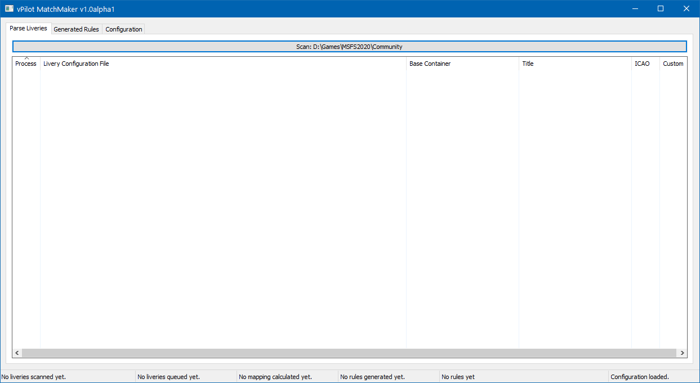
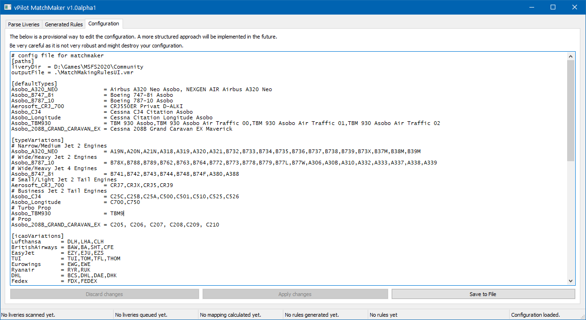

# MSFS VATSIM vPilot MatchMaker v1.0 beta 1
[](https://github.com/frankkopp/msfs_model_matching/actions/workflows/go.yml)
[](https://github.com/frankkopp/msfs_model_matching/actions/workflows/codeql-analysis.yml)
[](https://goreportcard.com/report/github.com/frankkopp/msfs_model_matching)
[](https://github.com/frankkopp/WorkerPool/blob/master/LICENSE)

Automatically generates a vPilot match making file (VMR) for all liveries in the given folder.
It allows to configure the base-sim-plane-models to be used, the default-liveries to be used 
and also a list of alternative ICAO codes for airlines which should use the same livery.

Version 1.0 and later have a Windows UI and use one ini-file for configuration which 
can be edited within the UI.

## Download

- Current Release: https://github.com/frankkopp/msfs_model_matching/releases/tag/v1.0beta1
- Latest build from commits to master: https://github.com/frankkopp/msfs_model_matching/releases/tag/latest

## Installation
- Download the latest release, or the most current master build as zip files
- Extract this to a folder (I use the vPilot files folder in my Documents folder)
- When started, the app creates a default ini which can be saved to disk from the UI 
- You can also download example ini- and rules-files from the /examples folder 

If you do not like to download and run an exe file then you can always compile by yourself:
- Download and install go (v1.16 or newer) here: https://golang.org/dl/
- Build: go.exe build -o .\matchmaker.exe ./cmd/matchmaker/...
- Start: .\matchmaker.exe

## Configuration
### matchmaker.ini
This contains all configuration for the application. It covers several sections:
- [paths]
  - liveryDir: the directory to search for liveries. 
  - outputFile: the path and filename where the rules should be stored
- [defaultTypes]
  - <base_container> = <default-livery>: 
    this maps a base_container (aka base plane / part of the livery aircraft.cfg data) to one or more default liveries. 
    vPilot chooses them if a player's icao callsign is unknown.
- [typeVariations]
  - <base_container> = <type_code, ...>: 
    this maps a base_container (aka base plane / part of the livery aircraft.cfg data) to one or more plane type codes.
    E.g. "A320" or "B748". vPilot uses the type code the pilot entered when connecting to determine the plane's 
    type and this mapping make sure an appropriate livery is mapped. 
- [icaoVariations]
  - <airline_name> = <icao, ...>:
    this list tells the application that several icao callsigns are to be mapped to the same livery. Many airlines 
    have several callsigns or pilot's use wrong ones. E.g. BAW (British Airways) also has SHT for Shuttle and some 
    users just use BA.
    vPilot extracts the icao from the pilot's callsign. E.g. DLH291 ==> DLH ==> Lufthansa
- [customData]
  - this section is handled by the UI only. It stores any changes to metadata of liveries. Mainly if the livery should
    be skipped or processed and to correct the ICAO code which is sometimes missing or wrong in the livery metadata.
  - No need to configure anything here.
- [application]
  - this section is handled by the UI only. It stores any data the application needs otherwise. 
    E.g. last window position.
  - No need to configure anything here.
  ``

## Usage (general)
matchmaker.exe can be used via the UI or the command line. 
When started without any options matchmaker uses the UI.
If there is no ini file matchmaker uses a default ini which can be saved as a file for the next start.

Run:
````
matchmaker.exe
````

### UI HowTo
The UI is simple and has three tabs and a statusbar. 
The tabs are:
- Parse Liveries: 
  - This has a list of all found liveries and their status. Livery metadata can be edited here and 
    liveries can be activated and deactivated.
    
    Click on the large Scan button so start the search for liveries in the configured folder.
    
  - How to read the list:
    
    - Process column:
      - green: livery can be used in rules
      - livery can't be used (ICAO missing)
      - check-mark 
        - when set livery will be used (NOT skipped)
        - when not set livery will be skipped
       
    - Line is green and Custom column has checkmark: there is a custom rule for this Livery
  
    - Base Container column:
      - if this is red the Base Container is not configured to be used. Add a default livery and 
        mapping to at least one ICAO if you want to use this livery.
        Of course the plane has to be installed in MSFS - e.g. "Aerosoft_CRJ_700", or others
        ````
        [defaultTypes]
        NEW_PLANE_MODEL = DEFAULT-LIVERY1, DEFAULT-LIVERY2
        [typeVariations]
        NEW_PLANE_MODEL = ICAO1, ICAO2
        ````
  



- Context menu:
  - Edit: to edit the metadata of the livery - basically only ICAO codes are editable
  - Remove: removes any custom rules for the Livery
  - Activate/Deactivate: use to activate/deactive multiple selected liveries
    


- Generated Rules:
  - This tab show the generated rules for vPilot
    Every time a change to the list is made all rules a (re-)generated with the most current configuration.
  - Rules can then be copied to clipboard or saved to file for direct use by vPilot.
  
  

- Configuration:
  - This tab shows a simple text editor to edit the ini directly in the UI.
  - Make sure to "Apply changes" when you edit the configuration and also use "Save to File" if you want to make your 
    changes permanent. 
    
    
Statusbar:
6 boxes: 
- number of liveries found
- number of liveries to process
- number of generated mappings**
- number of actual XML rules generated**
- reminder if rules are copied or saved
-  reminder if configuration is saved. 

** several mappings can become on rule
    
### Command line options

````
Usage of matchmaker.exe:
  -dir string
        path where liveries are searched recursively
  -ini string
        path to ini file (default "matchmaker.ini")
  -noUI
        does not use ui and starts directly with given configuration
  -outputFile string
        path and filename to output file
  -verbose
        prints additional information to console
  -version
        prints version and exits
````

## How it works:

When started MatchMaker.exe searches recursively for aircraft.cfg files in the given folder
- A livery's aircraft.cfg must contain these three data points otherwise it can't be processed:
    - base_container
    - icao_airline
    - title

For each found aircraft.cfg (aka Livery) rules will be created based on the ICAO code of the livery if the
base_container is a model which is configured and has at least one mapping to a plane type code.
If there are several liveries for an ICAO code, and a type code the liveries will be concatenated, so vPilot can
choose randomly which to use.
If metadata is missing it can be added in the gui and saved to the ini. 

Example:
- Livery for A320Neo for Lufthansa (DLH)
- Base container for A320Neo is: Asobo_A320_NEO
- TypeCodes for this base container are: A19N:A20N:A21N:A318:A319:A320:A321:B732:B733:B734:B735:B736:B737:B738:B739:B73X
- Alternative ICAO airline codes for DLH are: DLH:LHA:CLH

Generated rules:
````
<!-- AIRLINE ICAO: CLH -->
<!-- BASE TYPE: Asobo_A320_NEO -->
<ModelMatchRule CallsignPrefix="CLH" TypeCode="A19N" ModelName="Airbus A320 Neo Lufthansa AI OperatorLand468//Airbus A320 Neo Lufthansa Gummersbach OperatorLand468//Airbus A320 Neo Lufthansa Neubrandenburg OperatorLand468" />
<ModelMatchRule CallsignPrefix="CLH" TypeCode="A20N" ModelName="Airbus A320 Neo Lufthansa AI OperatorLand468//Airbus A320 Neo Lufthansa Gummersbach OperatorLand468//Airbus A320 Neo Lufthansa Neubrandenburg OperatorLand468" />
<ModelMatchRule CallsignPrefix="CLH" TypeCode="A21N" ModelName="Airbus A320 Neo Lufthansa AI OperatorLand468//Airbus A320 Neo Lufthansa Gummersbach OperatorLand468//Airbus A320 Neo Lufthansa Neubrandenburg OperatorLand468" />
<ModelMatchRule CallsignPrefix="CLH" TypeCode="A318" ModelName="Airbus A320 Neo Lufthansa AI OperatorLand468//Airbus A320 Neo Lufthansa Gummersbach OperatorLand468//Airbus A320 Neo Lufthansa Neubrandenburg OperatorLand468" />
<ModelMatchRule CallsignPrefix="CLH" TypeCode="A319" ModelName="Airbus A320 Neo Lufthansa AI OperatorLand468//Airbus A320 Neo Lufthansa Gummersbach OperatorLand468//Airbus A320 Neo Lufthansa Neubrandenburg OperatorLand468" />
<ModelMatchRule CallsignPrefix="CLH" TypeCode="A320" ModelName="Airbus A320 Neo Lufthansa AI OperatorLand468//Airbus A320 Neo Lufthansa Gummersbach OperatorLand468//Airbus A320 Neo Lufthansa Neubrandenburg OperatorLand468" />
<ModelMatchRule CallsignPrefix="CLH" TypeCode="A321" ModelName="Airbus A320 Neo Lufthansa AI OperatorLand468//Airbus A320 Neo Lufthansa Gummersbach OperatorLand468//Airbus A320 Neo Lufthansa Neubrandenburg OperatorLand468" />
<ModelMatchRule CallsignPrefix="CLH" TypeCode="B732" ModelName="Airbus A320 Neo Lufthansa AI OperatorLand468//Airbus A320 Neo Lufthansa Gummersbach OperatorLand468//Airbus A320 Neo Lufthansa Neubrandenburg OperatorLand468" />
<ModelMatchRule CallsignPrefix="CLH" TypeCode="B733" ModelName="Airbus A320 Neo Lufthansa AI OperatorLand468//Airbus A320 Neo Lufthansa Gummersbach OperatorLand468//Airbus A320 Neo Lufthansa Neubrandenburg OperatorLand468" />
<ModelMatchRule CallsignPrefix="CLH" TypeCode="B734" ModelName="Airbus A320 Neo Lufthansa AI OperatorLand468//Airbus A320 Neo Lufthansa Gummersbach OperatorLand468//Airbus A320 Neo Lufthansa Neubrandenburg OperatorLand468" />
<ModelMatchRule CallsignPrefix="CLH" TypeCode="B735" ModelName="Airbus A320 Neo Lufthansa AI OperatorLand468//Airbus A320 Neo Lufthansa Gummersbach OperatorLand468//Airbus A320 Neo Lufthansa Neubrandenburg OperatorLand468" />
<ModelMatchRule CallsignPrefix="CLH" TypeCode="B736" ModelName="Airbus A320 Neo Lufthansa AI OperatorLand468//Airbus A320 Neo Lufthansa Gummersbach OperatorLand468//Airbus A320 Neo Lufthansa Neubrandenburg OperatorLand468" />
<ModelMatchRule CallsignPrefix="CLH" TypeCode="B737" ModelName="Airbus A320 Neo Lufthansa AI OperatorLand468//Airbus A320 Neo Lufthansa Gummersbach OperatorLand468//Airbus A320 Neo Lufthansa Neubrandenburg OperatorLand468" />
<ModelMatchRule CallsignPrefix="CLH" TypeCode="B738" ModelName="Airbus A320 Neo Lufthansa AI OperatorLand468//Airbus A320 Neo Lufthansa Gummersbach OperatorLand468//Airbus A320 Neo Lufthansa Neubrandenburg OperatorLand468" />
<ModelMatchRule CallsignPrefix="CLH" TypeCode="B739" ModelName="Airbus A320 Neo Lufthansa AI OperatorLand468//Airbus A320 Neo Lufthansa Gummersbach OperatorLand468//Airbus A320 Neo Lufthansa Neubrandenburg OperatorLand468" />
<ModelMatchRule CallsignPrefix="CLH" TypeCode="B73X" ModelName="Airbus A320 Neo Lufthansa AI OperatorLand468//Airbus A320 Neo Lufthansa Gummersbach OperatorLand468//Airbus A320 Neo Lufthansa Neubrandenburg OperatorLand468" />

<!-- AIRLINE ICAO: DLH -->
<!-- BASE TYPE: Asobo_A320_NEO -->
<ModelMatchRule CallsignPrefix="DLH" TypeCode="A19N" ModelName="Airbus A320 Neo Lufthansa AI OperatorLand468//Airbus A320 Neo Lufthansa Gummersbach OperatorLand468//Airbus A320 Neo Lufthansa Neubrandenburg OperatorLand468" />
<ModelMatchRule CallsignPrefix="DLH" TypeCode="A20N" ModelName="Airbus A320 Neo Lufthansa AI OperatorLand468//Airbus A320 Neo Lufthansa Gummersbach OperatorLand468//Airbus A320 Neo Lufthansa Neubrandenburg OperatorLand468" />
<ModelMatchRule CallsignPrefix="DLH" TypeCode="A21N" ModelName="Airbus A320 Neo Lufthansa AI OperatorLand468//Airbus A320 Neo Lufthansa Gummersbach OperatorLand468//Airbus A320 Neo Lufthansa Neubrandenburg OperatorLand468" />
<ModelMatchRule CallsignPrefix="DLH" TypeCode="A318" ModelName="Airbus A320 Neo Lufthansa AI OperatorLand468//Airbus A320 Neo Lufthansa Gummersbach OperatorLand468//Airbus A320 Neo Lufthansa Neubrandenburg OperatorLand468" />
<ModelMatchRule CallsignPrefix="DLH" TypeCode="A319" ModelName="Airbus A320 Neo Lufthansa AI OperatorLand468//Airbus A320 Neo Lufthansa Gummersbach OperatorLand468//Airbus A320 Neo Lufthansa Neubrandenburg OperatorLand468" />
<ModelMatchRule CallsignPrefix="DLH" TypeCode="A320" ModelName="Airbus A320 Neo Lufthansa AI OperatorLand468//Airbus A320 Neo Lufthansa Gummersbach OperatorLand468//Airbus A320 Neo Lufthansa Neubrandenburg OperatorLand468" />
<ModelMatchRule CallsignPrefix="DLH" TypeCode="A321" ModelName="Airbus A320 Neo Lufthansa AI OperatorLand468//Airbus A320 Neo Lufthansa Gummersbach OperatorLand468//Airbus A320 Neo Lufthansa Neubrandenburg OperatorLand468" />
<ModelMatchRule CallsignPrefix="DLH" TypeCode="B732" ModelName="Airbus A320 Neo Lufthansa AI OperatorLand468//Airbus A320 Neo Lufthansa Gummersbach OperatorLand468//Airbus A320 Neo Lufthansa Neubrandenburg OperatorLand468" />
<ModelMatchRule CallsignPrefix="DLH" TypeCode="B733" ModelName="Airbus A320 Neo Lufthansa AI OperatorLand468//Airbus A320 Neo Lufthansa Gummersbach OperatorLand468//Airbus A320 Neo Lufthansa Neubrandenburg OperatorLand468" />
<ModelMatchRule CallsignPrefix="DLH" TypeCode="B734" ModelName="Airbus A320 Neo Lufthansa AI OperatorLand468//Airbus A320 Neo Lufthansa Gummersbach OperatorLand468//Airbus A320 Neo Lufthansa Neubrandenburg OperatorLand468" />
<ModelMatchRule CallsignPrefix="DLH" TypeCode="B735" ModelName="Airbus A320 Neo Lufthansa AI OperatorLand468//Airbus A320 Neo Lufthansa Gummersbach OperatorLand468//Airbus A320 Neo Lufthansa Neubrandenburg OperatorLand468" />
<ModelMatchRule CallsignPrefix="DLH" TypeCode="B736" ModelName="Airbus A320 Neo Lufthansa AI OperatorLand468//Airbus A320 Neo Lufthansa Gummersbach OperatorLand468//Airbus A320 Neo Lufthansa Neubrandenburg OperatorLand468" />
<ModelMatchRule CallsignPrefix="DLH" TypeCode="B737" ModelName="Airbus A320 Neo Lufthansa AI OperatorLand468//Airbus A320 Neo Lufthansa Gummersbach OperatorLand468//Airbus A320 Neo Lufthansa Neubrandenburg OperatorLand468" />
<ModelMatchRule CallsignPrefix="DLH" TypeCode="B738" ModelName="Airbus A320 Neo Lufthansa AI OperatorLand468//Airbus A320 Neo Lufthansa Gummersbach OperatorLand468//Airbus A320 Neo Lufthansa Neubrandenburg OperatorLand468" />
<ModelMatchRule CallsignPrefix="DLH" TypeCode="B739" ModelName="Airbus A320 Neo Lufthansa AI OperatorLand468//Airbus A320 Neo Lufthansa Gummersbach OperatorLand468//Airbus A320 Neo Lufthansa Neubrandenburg OperatorLand468" />
<ModelMatchRule CallsignPrefix="DLH" TypeCode="B73X" ModelName="Airbus A320 Neo Lufthansa AI OperatorLand468//Airbus A320 Neo Lufthansa Gummersbach OperatorLand468//Airbus A320 Neo Lufthansa Neubrandenburg OperatorLand468" />

<!-- BASE TYPE: Asobo_A320_NEO -->
<ModelMatchRule CallsignPrefix="LHA" TypeCode="A19N" ModelName="Airbus A320 Neo Lufthansa AI OperatorLand468//Airbus A320 Neo Lufthansa Gummersbach OperatorLand468//Airbus A320 Neo Lufthansa Neubrandenburg OperatorLand468" />
<ModelMatchRule CallsignPrefix="LHA" TypeCode="A20N" ModelName="Airbus A320 Neo Lufthansa AI OperatorLand468//Airbus A320 Neo Lufthansa Gummersbach OperatorLand468//Airbus A320 Neo Lufthansa Neubrandenburg OperatorLand468" />
<ModelMatchRule CallsignPrefix="LHA" TypeCode="A21N" ModelName="Airbus A320 Neo Lufthansa AI OperatorLand468//Airbus A320 Neo Lufthansa Gummersbach OperatorLand468//Airbus A320 Neo Lufthansa Neubrandenburg OperatorLand468" />
<ModelMatchRule CallsignPrefix="LHA" TypeCode="A318" ModelName="Airbus A320 Neo Lufthansa AI OperatorLand468//Airbus A320 Neo Lufthansa Gummersbach OperatorLand468//Airbus A320 Neo Lufthansa Neubrandenburg OperatorLand468" />
<ModelMatchRule CallsignPrefix="LHA" TypeCode="A319" ModelName="Airbus A320 Neo Lufthansa AI OperatorLand468//Airbus A320 Neo Lufthansa Gummersbach OperatorLand468//Airbus A320 Neo Lufthansa Neubrandenburg OperatorLand468" />
<ModelMatchRule CallsignPrefix="LHA" TypeCode="A320" ModelName="Airbus A320 Neo Lufthansa AI OperatorLand468//Airbus A320 Neo Lufthansa Gummersbach OperatorLand468//Airbus A320 Neo Lufthansa Neubrandenburg OperatorLand468" />
<ModelMatchRule CallsignPrefix="LHA" TypeCode="A321" ModelName="Airbus A320 Neo Lufthansa AI OperatorLand468//Airbus A320 Neo Lufthansa Gummersbach OperatorLand468//Airbus A320 Neo Lufthansa Neubrandenburg OperatorLand468" />
<ModelMatchRule CallsignPrefix="LHA" TypeCode="B732" ModelName="Airbus A320 Neo Lufthansa AI OperatorLand468//Airbus A320 Neo Lufthansa Gummersbach OperatorLand468//Airbus A320 Neo Lufthansa Neubrandenburg OperatorLand468" />
<ModelMatchRule CallsignPrefix="LHA" TypeCode="B733" ModelName="Airbus A320 Neo Lufthansa AI OperatorLand468//Airbus A320 Neo Lufthansa Gummersbach OperatorLand468//Airbus A320 Neo Lufthansa Neubrandenburg OperatorLand468" />
<ModelMatchRule CallsignPrefix="LHA" TypeCode="B734" ModelName="Airbus A320 Neo Lufthansa AI OperatorLand468//Airbus A320 Neo Lufthansa Gummersbach OperatorLand468//Airbus A320 Neo Lufthansa Neubrandenburg OperatorLand468" />
<ModelMatchRule CallsignPrefix="LHA" TypeCode="B735" ModelName="Airbus A320 Neo Lufthansa AI OperatorLand468//Airbus A320 Neo Lufthansa Gummersbach OperatorLand468//Airbus A320 Neo Lufthansa Neubrandenburg OperatorLand468" />
<ModelMatchRule CallsignPrefix="LHA" TypeCode="B736" ModelName="Airbus A320 Neo Lufthansa AI OperatorLand468//Airbus A320 Neo Lufthansa Gummersbach OperatorLand468//Airbus A320 Neo Lufthansa Neubrandenburg OperatorLand468" />
<ModelMatchRule CallsignPrefix="LHA" TypeCode="B737" ModelName="Airbus A320 Neo Lufthansa AI OperatorLand468//Airbus A320 Neo Lufthansa Gummersbach OperatorLand468//Airbus A320 Neo Lufthansa Neubrandenburg OperatorLand468" />
<ModelMatchRule CallsignPrefix="LHA" TypeCode="B738" ModelName="Airbus A320 Neo Lufthansa AI OperatorLand468//Airbus A320 Neo Lufthansa Gummersbach OperatorLand468//Airbus A320 Neo Lufthansa Neubrandenburg OperatorLand468" />
<ModelMatchRule CallsignPrefix="LHA" TypeCode="B739" ModelName="Airbus A320 Neo Lufthansa AI OperatorLand468//Airbus A320 Neo Lufthansa Gummersbach OperatorLand468//Airbus A320 Neo Lufthansa Neubrandenburg OperatorLand468" />
<ModelMatchRule CallsignPrefix="LHA" TypeCode="B73X" ModelName="Airbus A320 Neo Lufthansa AI OperatorLand468//Airbus A320 Neo Lufthansa Gummersbach OperatorLand468//Airbus A320 Neo Lufthansa Neubrandenburg OperatorLand468" />
````
